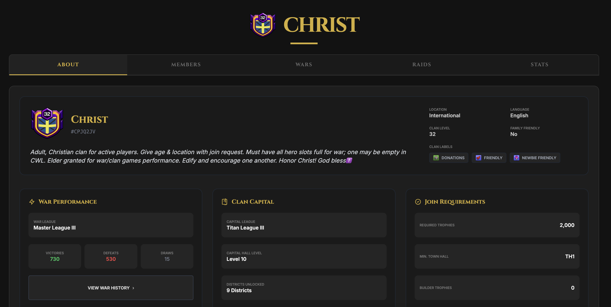
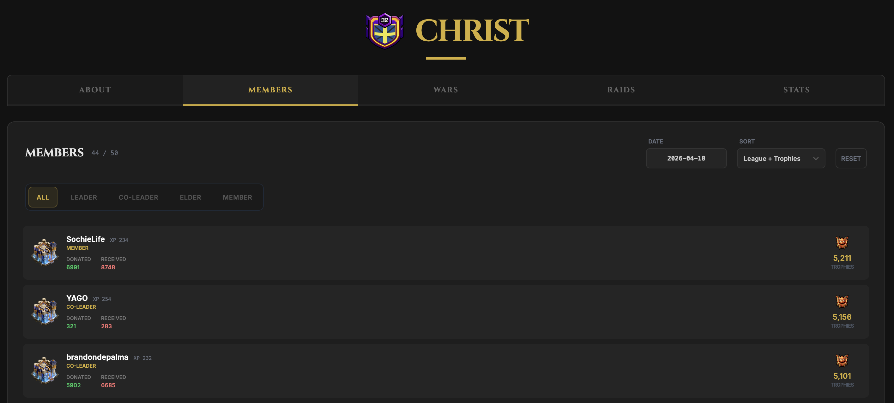
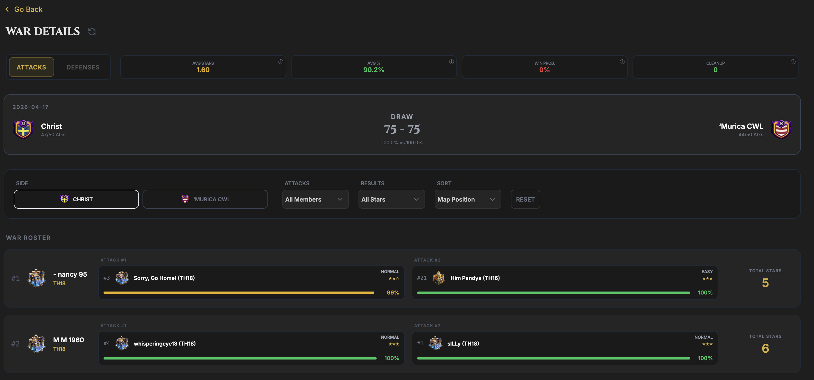
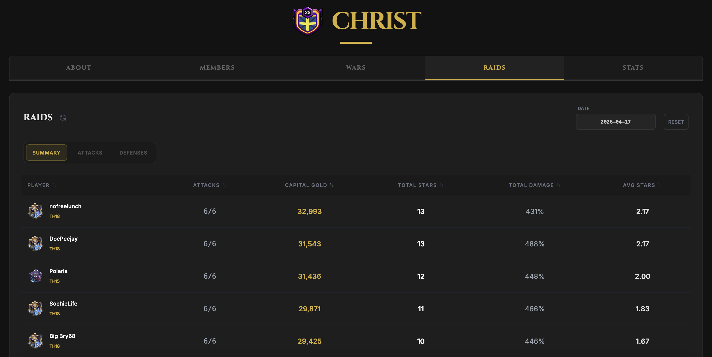
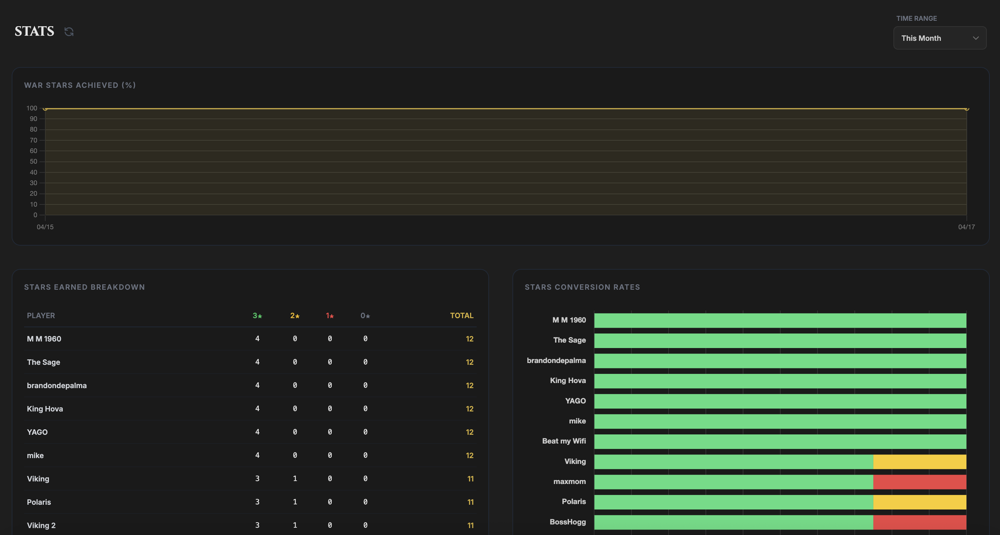

# CoC War Stats Dashboard

A sophisticated dashboard for tracking Clash of Clans performance with advanced analytics and real-time win probability calculations. This project uses a Python scraper and GitHub Actions to automatically update data on a recurring schedule.

See live example: https://clash.kenaz.dev

## Features

### About Tab
View comprehensive clan overview with war performance metrics, league standings, and join requirements.

### Members Tab
Track all clan members with dynamic filtering by role (Leader, Co-Leader, Elder, Member). View donation history and trophy counts with date-based historical snapshots.

### ⚔️ Wars Tab
Deep-dive war analysis with:
- **Advanced Win Probability** - Sophisticated algorithm analyzing:
  - Player Month-to-Date (MTD) star averages
  - Town Hall ceiling caps and hard-cap logic (TH14 vs TH18 = 1-2 star max)
  - Defense insurance calculations
  - Late-war volatility sensitivity
  - Score gap vs remaining potential stars
- War roster comparison (attacks & defenses)
- Metrics: Avg Stars, Avg %, Win Prob., and Cleanup Needed
- Full historical archive of past wars (war history will only show wars that take place after you start using this tool due to API restrictions)

### 🏆 Raids Tab
Seasonal raid tracking with comprehensive player performance metrics:
- Attacks completed and gold earned
- Total damage and destruction percentage
- Average stars per attack
- Summary, Attacks, and Defenses breakdowns

### 📈 Stats Tab
Month-to-date statistical analysis with three key visualizations:
- **War Stars Achieved (%)** - Trend line showing clan star performance over time
- **Stars Earned Breakdown** - Top 25 players with 3★ / 2★ / 1★ / 0★ counts
- **Stars Conversion Rates** - Star conversion efficiency for top 25 players

Time range filtering available (This Month, Week, Previous War).

## Setup Instructions

### 1. API Credentials
Note: We are using the [RoyalAPI](https://docs.royaleapi.com/proxy.html) proxy but you still need the API token from Clash of Clans.
* Register for an account at [developer.clashofclans.com](https://developer.clashofclans.com).
* Create a new API key. 
* Copy your API Token.

### 2. GitHub Secrets Configuration
To keep your credentials secure, do not place them in a .env file within the repository. Instead, configure them in GitHub:
* Navigate to your repository on GitHub.
* Go to Settings > Secrets and variables > Actions.
* Click New repository secret and add the following:
    * COC_API_TOKEN: Paste your secret API token.
    * CLAN_TAG: Enter your clan tag including the # symbol.

### 3. Workflow Permissions
The automation requires permission to commit the updated JSON data back to your repository.
* Go to Settings > Actions > General.
* Scroll to the Workflow permissions section.
* Select Read and write permissions.
* Click Save.

### 4. Deployment
* Go to Settings > Pages.
* Under Build and deployment, set Source to Deploy from a branch.
* Select the main branch and the /(root) folder.
* Click Save. Your dashboard will be live at the URL provided by GitHub.

## Automation and Manual Updates
The dashboard is automatically kept up-to-date via GitHub Actions:

- **Wars & Raids**: Refreshed every **15 minutes** to provide real-time tactical reporting.
- **Clan Members**: Refreshed every **24 hours** to track long-term trends and donation stats.

To trigger an update manually:
* Navigate to the Actions tab in your repository.
* Select the desired Update workflow from the left sidebar.
* Click the Run workflow dropdown and select Run workflow.

## Technical Requirements
* Python 3.x
* Requests library
* Python-dotenv library
* GitHub Actions enabled

## Advanced Analytics

### Win Probability Algorithm
The dashboard features a sophisticated win probability calculator that goes beyond simple star counting:

- **Terminal Conditions**: Immediate 100% or 0% when war outcomes are mathematically decided
- **Player-Specific Expected Values**: Uses each attacker's historical MTD star average for their specific matchup
- **Opponent Sampling**: Calculates opponent threat level based on their average stars per attack
- **TH Ceiling Caps**: Models realistic star potential based on attacker/target TH level gaps
  - 4+ TH levels below target: 1-2 star max
  - 3 TH levels below: 2-3 star realistic
- **Defense Insurance**: Increases win probability when ahead if opponent lacks high-level threats remaining
- **Late-War Volatility**: Amplifies sensitivity as attacks decrease (late failures cause larger swings)
- **Score Gap vs Potential**: Weighs current star difference against total possible remaining stars

### Data Persistence
- Automatic data snapshots stored in your repository
- Historical member rosters stored for trend analysis
- Complete war history maintained for statistical aggregation
